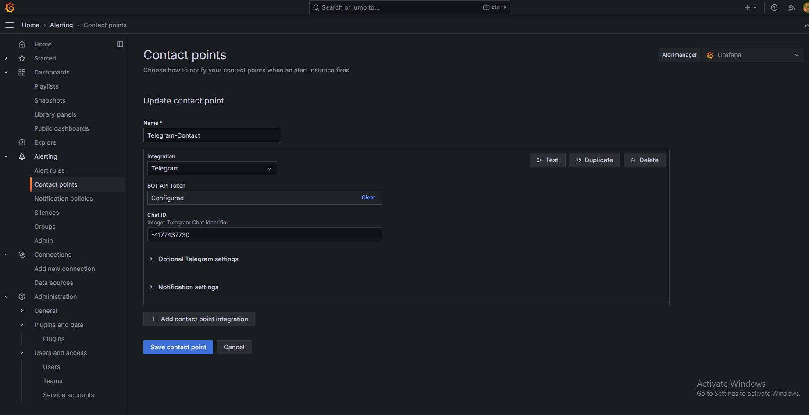

# How to add Alert Communication to Grafana

1. Create a new Telegram Bot with BotFather, and name it something appropriate for the project
2. Get the bot api token, for this example, it will be `TOKEN1234` 
3. Create a new group, add the bot inside, and inside BotFather, ensure that the bot has **access to messages**. You can check this status by clicking the group to see all the members, and the bot should say `has access to all messages` or `can read all messages`
4. After that, send a test message inside the group. It needs to contain some text, so just send `TEST`
5. Visit https://api.telegram.org/botTOKEN1234/getUpdates, **delete TOKEN1234 And paste in your bot api token, no need for spacing/slashes, its all one word**
6. If done correctly, if you visit it the API URI, you should see your message. Reading the json structure, scroll all the way to the bottom and find your chat.id value
7. Next, go to Alerting>ContactPoints, you should get to the contact points page, and there will be a default email contact there. 
8.  Choose a name, select Telegram as your contact, and add in the BotAPItoken
9. After saving, you need to go to `Alerting>Alert rules` and add a new rule, and maybe also go to `NotificationPolicies`. I just fiddled around with it and got something out, but from the youtube tutorial I watched, apparently you can add it to the dashboard so that when an alert is fired, if you attach it to the updating graph for example, it'll send a still of the graph when the alert was triggered. I think the official grafana documentation at https://grafana.com/docs/grafana/latest/alerting/ will be more helpful

# Alert Communication Methods
Email, Slack, Discord, Telegram, Teams and also **webhook** and also others.
Therefore in theory, can link webhook to our own custom alert system if we so desire, but grab low hanging fruit and do Telegram and Email First. Slack would be better than Teams to test on because Teams seems to require granting grafana admin-like permissions, which can only be done as an admin. 